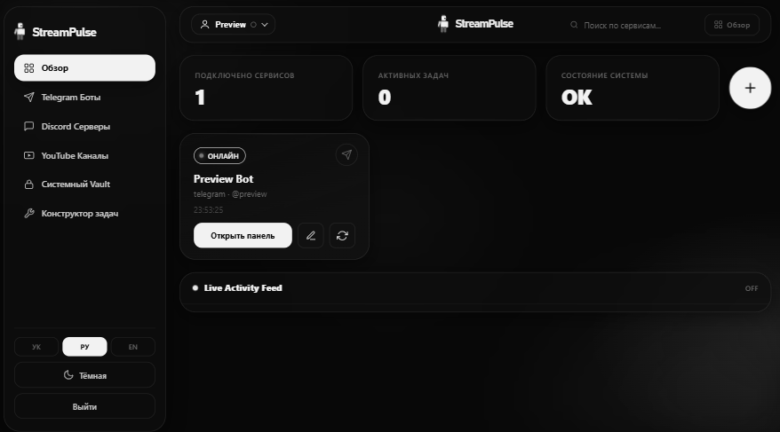

# StreamPulse

<div align="center">

### Ваши платформы. В одном месте.

**StreamPulse** — self-hosted панель управления интеграциями Telegram, Discord и YouTube. Подключайте сервисы, запускайте действия, следите за задачами и событиями в одном спокойном чёрно-белом интерфейсе.

<br>

[Быстрый запуск](#-демо-и-быстрый-запуск) ·
[Возможности](#-возможности) ·
[Интеграции](#-поддерживаемые-действия) ·
[API](#-api) ·
[Безопасность](#-безопасность) ·
[Связаться с автором](#-разработка-на-заказ)

<br>


</div>

---

## Демо

Ниже — скриншот панели StreamPulse. Чтобы открыть **интерактивную версию**, запустите проект по инструкции и перейдите на [http://localhost:8000](http://localhost:8000). После регистрации добавьте собственную интеграцию: демонстрационные подключения и чужие API-ключи в проект не встроены.

<p align="center">
  
</p>

> **Важно:** публичный экземпляр StreamPulse пока не размещён. Адрес `localhost` доступен только на вашем компьютере; для публичной демонстрации проект нужно отдельно развернуть на сервере с HTTPS.

### Что попробовать в демо

1. Создайте аккаунт или войдите в существующий.
2. Добавьте интеграцию Telegram, Discord или YouTube с собственными данными доступа.
3. Откройте панель подключения, выберите действие и запустите задачу.
4. Проверьте статус интеграции, результат выполнения и ленту событий.

---

## ✨ Возможности

- **Общий обзор:** подключённые сервисы, активные задачи и состояние системы.
- **Три платформы:** Telegram Bot API, Discord API v10 и YouTube Data API v3.
- **Действия по кнопке:** формы подстраиваются под выбранную платформу и операцию.
- **История запусков:** состояние, время, результат и сообщение об ошибке для каждой задачи.
- **Лента событий:** последние события загружаются из истории; при Redis включена публикация событий в реальном времени по WebSocket.
- **Защищённые подключения:** API-ключи и токены интеграций шифруются перед сохранением и маскируются в ответах API.
- **Аккаунты:** регистрация, вход, профиль и языковые/тематические настройки.
- **Три языка интерфейса:** украинский, русский и английский.
- **Светлая и тёмная темы:** минималистичный монохромный визуальный стиль.
- **Два режима запуска:** локальная разработка с SQLite или контейнерное развертывание с PostgreSQL и Redis.

---

## 🔌 Поддерживаемые действия

### Telegram

| Действие | Назначение |
| --- | --- |
| Рассылка | Отправить текст нескольким настроенным чатам |
| Отправить сообщение | Отправить текст в выбранный чат |
| Статистика | Проверить бота и доступную статистику чата |
| Информация о чате | Получить данные чата или канала |
| Участники | Показать доступное количество участников и администраторов |
| Администраторы | Получить доступный список администраторов |
| Информация о webhook | Проверить состояние webhook бота |
| Команды бота | Получить настроенные команды |
| Опрос | Создать опрос в выбранном чате |

**Ограничение Telegram Bot API:** бот не может получить полный список участников группы или канала. Приложение показывает только те сведения, которые разрешает API и доступы бота.

### Discord

| Действие | Назначение |
| --- | --- |
| Аудит | Проверить бота и выбранный сервер |
| Отправить сообщение | Отправить сообщение в текстовый канал |
| Модерация / обзор | Получить доступные сведения о сервере, ролях и выборке участников |
| Webhook | Просмотреть webhook-адреса канала; создание доступно при передаче параметра `create` |
| Информация о сервере | Получить сведения о guild |
| Каналы | Получить список каналов сервера |
| Роли | Получить список ролей сервера |
| Приглашения | Получить доступные приглашения |
| Закреплённые сообщения | Получить закреплённые сообщения канала |

Доступность операций Discord зависит от разрешений бота и его присутствия на сервере.

### YouTube

| Действие | Назначение |
| --- | --- |
| Синхронизация | Получить статистику канала и статус прямого эфира |
| Прямой эфир | Найти активные трансляции канала |
| Видео | Получить последние видео и доступную статистику |
| Информация о видео | Получить сведения и статистику видео |
| Плейлисты | Получить список плейлистов канала |
| Поиск | Искать видео в пределах подключённого канала |

---

## 🚀 Демо и быстрый запуск

### Требования

- Python **3.12**
- Windows для запуска через `start_local.bat`; macOS/Linux — для запуска командами ниже
- Доступ к интернету для установки пакетов и работы с API платформ
- Для использования интеграций — собственные токены/ключи и необходимые разрешения

Для локального режима PostgreSQL, Redis и Docker не нужны. Используются SQLite и локальное выполнение задач.

### Windows

1. Скачайте проект или клонируйте репозиторий.
2. Откройте папку проекта и запустите `start_local.bat`.
3. Скрипт создаст виртуальное окружение, установит зависимости, создаст недостающие ключи в `.env` и запустит сервер.
4. Откройте [http://localhost:8000](http://localhost:8000).
5. Зарегистрируйтесь и подключите собственную интеграцию.

### macOS / Linux / ручной запуск

Из корневой папки проекта:

```bash
python3.12 -m venv .venv
```

Активируйте окружение:

```bash
# macOS / Linux
source .venv/bin/activate
```

```powershell
# Windows PowerShell
.\.venv\Scripts\Activate.ps1
```

Установите локальные зависимости и подготовьте конфигурацию:

```bash
python -m pip install --upgrade pip
python -m pip install -r requirements-local.txt
```

```bash
# macOS / Linux
cp .env.example .env
```

```powershell
# Windows PowerShell
Copy-Item .env.example .env
```

Сгенерируйте секреты, не перезаписывая уже настроенные:

```bash
python generate_keys.py --write
```

Запустите приложение:

```bash
python run_local.py
```

Откройте [http://localhost:8000](http://localhost:8000). Для остановки нажмите `Ctrl+C`.

> Локальный запуск автоматически использует SQLite и режим очереди без Redis. Файл `streampulse.db` создаётся рядом с приложением и исключён из Git.

---

## ⚙️ Подключение платформ

### Telegram

1. Создайте бота через [@BotFather](https://t.me/BotFather) и скопируйте токен.
2. Добавьте бота в нужную группу/канал и выдайте необходимые разрешения.
3. В StreamPulse выберите Telegram и укажите токен.
4. Для операций с чатом укажите chat ID, если он не задан в настройках подключения.

### Discord

1. Создайте приложение и бота в [Discord Developer Portal](https://discord.com/developers/applications).
2. Скопируйте bot token и пригласите бота на нужный сервер с необходимыми разрешениями.
3. В StreamPulse укажите bot token; для удобства можно сохранить ID сервера и канала.
4. Убедитесь, что включены разрешения для выбранного действия. Некоторые сведения Discord API доступны только боту с соответствующими permissions.

### YouTube

1. Создайте API key и включите YouTube Data API v3 в [Google Cloud Console](https://console.cloud.google.com/).
2. Узнайте ID YouTube-канала.
3. Добавьте интеграцию YouTube, указав API key и channel ID.
4. Учитывайте квоты YouTube Data API: поиск и некоторые запросы расходуют квоту проекта Google Cloud.

**Не вставляйте токены и ключи в README, Issues, скриншоты или публичные логи.** Используйте только свои данные доступа и соблюдайте правила платформ.

---

## 🧱 Архитектура

```text
Браузер
  ├── HTML-шаблоны, CSS и JavaScript
  ├── REST API /api/v1/*
  └── WebSocket /ws/feed
          │
          ▼
FastAPI ─ SQLAlchemy ─ SQLite (локально) / PostgreSQL (контейнеры)
          │
          ├── Telegram adapter ─ Telegram Bot API
          ├── Discord adapter  ─ Discord API v10
          └── YouTube adapter  ─ YouTube Data API v3

Контейнерный режим:
FastAPI ─ Redis ─ Celery worker ─ PostgreSQL
                    └── Celery beat: обновление статусов
```

### Основные каталоги

| Путь | Назначение |
| --- | --- |
| `app/api/v1/` | HTTP API: авторизация, интеграции, действия, статистика и настройки пользователя |
| `app/adapters/` | Адаптеры Telegram, Discord и YouTube |
| `app/models/` | Модели пользователей, интеграций, задач и событий |
| `app/services/` | Бизнес-логика и работа с данными |
| `app/worker/` | Выполнение фоновых задач и периодическое обновление статусов |
| `app/websocket/` | Авторизованная лента событий |
| `app/templates/` | Страницы и панели интерфейса |
| `app/static/` | Стили и клиентские скрипты |
| `alembic/` | Миграции базы данных |

---

## 📡 API

После запуска интерактивная документация FastAPI доступна по адресу [http://localhost:8000/docs](http://localhost:8000/docs).

Основные маршруты:

| Метод | Путь | Назначение |
| --- | --- | --- |
| `POST` | `/api/v1/auth/register` | Создать пользователя |
| `POST` | `/api/v1/auth/login` | Войти и получить access token |
| `GET` | `/api/v1/auth/me` | Получить профиль авторизованного пользователя |
| `GET` | `/api/v1/integrations` | Список своих интеграций |
| `POST` | `/api/v1/integrations` | Создать интеграцию |
| `PATCH` | `/api/v1/integrations/{id}` | Обновить интеграцию |
| `DELETE` | `/api/v1/integrations/{id}` | Удалить интеграцию |
| `POST` | `/api/v1/integrations/{id}/check` | Проверить подключение |
| `GET` | `/api/v1/integrations/{id}/runs` | История задач интеграции |
| `POST` | `/api/v1/actions/run` | Запустить действие |
| `GET` | `/api/v1/actions/history` | История запусков пользователя |
| `GET` | `/api/v1/stats` | Сводные показатели |
| `GET` | `/api/v1/stats/platforms` | Статистика по платформам |
| `GET` | `/api/v1/events` | Последние события |
| `PATCH` | `/api/v1/users/prefs` | Обновить язык и тему |
| `GET` | `/health` | Проверка доступности приложения |

Защищённые HTTP-маршруты используют `Authorization: Bearer <access_token>`. WebSocket-аутентификация выполняется отдельным протоколом подключения; JWT не помещается в URL.

---

## 🐳 Контейнерный запуск

Контейнерная конфигурация запускает PostgreSQL, Redis, API, Celery worker и Celery beat:

```bash
docker compose up --build -d
```

Перед запуском заполните `.env` на основе `.env.example` и настройте уникальный `POSTGRES_PASSWORD`, `SECRET_KEY` и `FERNET_KEY`. Для контейнерной конфигурации база данных и Redis заданы в Compose.

Проверить состояние контейнеров:

```bash
docker compose ps
docker compose logs -f api worker
```

Остановить контейнеры, сохранив данные:

```bash
docker compose down
```

Compose публикует API только на `127.0.0.1:8000`. Для публичного размещения настройте reverse proxy с HTTPS, ограничьте сетевой доступ и используйте отдельные надёжные секреты. Не публикуйте внутренние порты PostgreSQL/Redis.

---

## 🔐 Безопасность и данные

- Пароли пользователей хранятся в виде bcrypt-хеша.
- Учетные данные интеграций шифруются с помощью Fernet; для их расшифровки необходим постоянный `FERNET_KEY`.
- JWT подписывается секретом `SECRET_KEY` и имеет ограниченный срок действия.
- API проверяет принадлежность интеграции текущему пользователю.
- В браузерном интерфейсе значения сохранённых ключей маскируются.
- `.env`, базы данных и виртуальное окружение исключены из Git.
- Первый зарегистрированный пользователь получает роль администратора. Если приложение открыто в публичном интернете, закройте публичную регистрацию или добавьте собственный контроль доступа до запуска.

### Резервное копирование

В production регулярно сохраняйте PostgreSQL и безопасную копию конфигурации секретов. Без оригинального `FERNET_KEY` уже сохранённые credentials интеграций восстановить нельзя. Храните резервные копии отдельно от публичного репозитория и ограничивайте к ним доступ.

---

## 🧰 Основные команды

| Команда | Назначение |
| --- | --- |
| `python generate_keys.py` | Сгенерировать секреты и вывести их в консоль |
| `python generate_keys.py --write` | Записать недостающие ключи в `.env`, сохранив настроенные |
| `python run_local.py` | Запустить локальный SQLite-режим |
| `alembic upgrade head` | Применить миграции в настроенной базе |
| `docker compose up --build` | Собрать и запустить контейнеры |
| `docker compose logs -f api worker` | Смотреть логи API и worker |

---

## 🩺 Если что-то не запускается

### Ошибка конфигурации ключей

Проверьте, что `.env` существует и в нём настроены `SECRET_KEY` и `FERNET_KEY`. Запустите `python generate_keys.py --write`. Не меняйте `FERNET_KEY` после подключения платформ: старые зашифрованные данные не смогут расшифроваться.

### Порт `8000` занят

Остановите другое приложение, занимающее порт, либо измените порт в запуске Uvicorn. Для ручного запуска можно выполнить `uvicorn app.main:app --host 127.0.0.1 --port 8010`.

### Интеграция не подключается

Проверьте токен/API key, ID чата/сервера/канала, разрешения бота, сетевой доступ и лимиты платформы. Для YouTube дополнительно проверьте, что API включён в Google Cloud и не исчерпана квота.

### Задачи остаются в очереди в Docker

Проверьте, что Redis и worker запущены и имеют статус healthy:

```bash
docker compose ps
docker compose logs -f redis worker
```

---

## 🗺️ Статус проекта

StreamPulse — развиваемый проект. Наличие работающих экранов и адаптеров не означает, что все операции протестированы на каждой конфигурации платформы: доступность данных зависит от разрешений, версии API и ограничений квот. Публичный demo-сервер, готовые demo-аккаунты и опубликованная лицензия пока не указаны.

---

## 💼 Разработка на заказ

**[@codepatch](https://t.me/codepatch)** — разработка цифровых продуктов под ключ:

- современные веб-дашборды, интерфейсы и сайты;
- посадочные страницы;
- Telegram-боты и автоматизация.

Для связи и заказов: **[@codepatche](https://t.me/codepatche)**  
Телефон / мессенджер: **[+380 660 328 245](tel:+380660328245)** · **[+380 986 158 874](tel:+380986158874)** · **[+380 933 878 633](tel:+380933878633)**

---

<div align="center">

**StreamPulse · Ваши платформы. В одном месте.**

Сделано с вниманием к деталям и удобству.

</div>
# StreamPulse

# StreamPulse

"# StreamPulse" 
